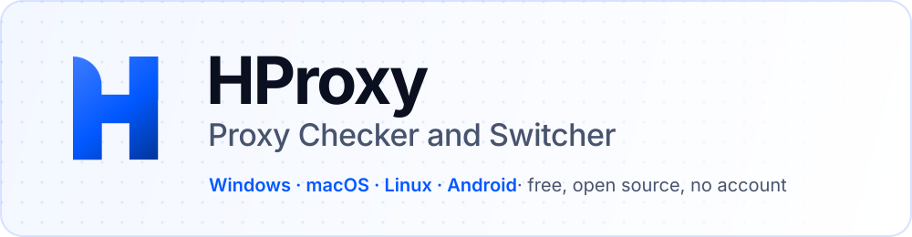

  

  
  <a href="macOS/"><picture><source media="(prefers-color-scheme: dark)" srcset="assets/coming-macos-dark.svg"></picture></a> 
  <a href="Linux/"><picture><source media="(prefers-color-scheme: dark)" srcset="assets/coming-linux-dark.svg"></picture></a>
  <a href="Android/"><picture><source media="(prefers-color-scheme: dark)" srcset="assets/coming-android-dark.svg"></picture></a>

  
  
  
  
  

<h3 align="center">The proxy all-in-one tool</h3>

<b>Check</b> any proxy list, see where every proxy comes out and how anonymous it is, then <b>switch</b> your computer, phone or browser to the one you pick.

## Download

| System | | |
| --- | --- | --- |
| **Windows** 10 and 11 | **[Download the installer](https://hproxy.com/downloads/desktop/hproxy-windows-x64-setup.exe)** | [how to install](Windows/) |
| **macOS** 12 and later, Apple Silicon and Intel | with the next version | [macOS](macOS/) |
| **Linux** x86_64: AppImage and .deb | with the next version | [Linux](Linux/) |
| **Android** 7 and later | Google Play and the APK | [Android](Android/) |
| **Command line and AI assistants** | `hproxy` and its MCP server | [source-code](source-code/README.md#command-line) |

## What it does

- **Checks any proxy list** in the format your provider prints it: HTTP, HTTPS, SOCKS4 and
  SOCKS5, detected per line, with every result showing the moment it arrives.
- **Shows the evidence**: where each proxy comes out (country, city, network), how anonymous it
  is, how long each step takes, which headers it added, and whether it reads your HTTPS. Never
  log in through one that does.
- **Fraud scores** for every working exit.
- **Switches** your computer to the proxy you pick, a list that rotates, or a free exit in the
  country you want, without typing a password anywhere.
- **Works from the command line and from AI assistants**: `hproxy check`, `hproxy connect`, and
  an MCP server with `proxy_list`, `proxy_check` and `ip_lookup`.
- **A Chrome extension** that does the same inside the browser.
- **Private by design**: checks run on your own device by default, and your list and its logins
  stay there. What goes out, and where to, is in [PRIVACY.md](source-code/PRIVACY.md).

## Build it yourself

Everything HProxy is made of is in [source-code](source-code/): the app (Tauri: Rust and React),
the command-line tool, the engine and the Chrome extension.
[source-code/README.md](source-code/README.md) says how to build and test each part.

Built by <a href="https://hproxy.com">HProxy</a> · <a href="LICENSE">MIT license</a>

